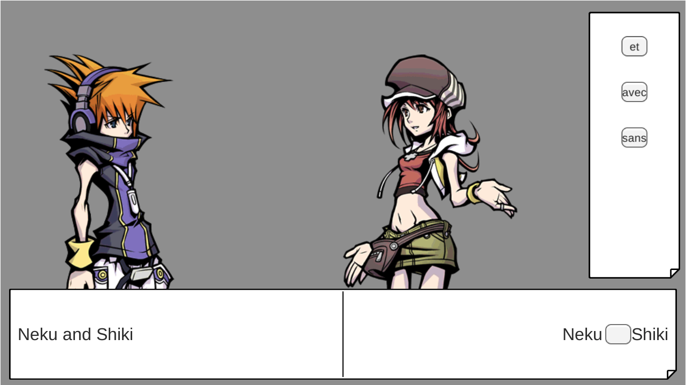

<a href="/listes">Revenir à l'index des listes d'asset</a>

# Henshin Project - List d'assets Scène 1

## Définition "Scène 1" :
La scène 1 du Henshin Project regroupe les textes 1 à 4 du document suivant: [Texte Seul](https://henshin.jb-caillaud.fr/recherches/texte_seul.html)

## Liste d'assets :
- Personnages
  - Pyrame
    - Idle
    - In Love
  - Thisbé
    - Idle
    - In Love
  - Pères
    - Idle
- Éléments du décor
  - Maisons
- Fonds
  - Ville de jour
- Interface
  - Boite de texte (Élément regroupant les deux phrases (traduite et non-traduite). Cf image ci-dessous)
  - "Boite à outils" (Élément regroupant les options pour les gameplay de reconstruction de phrase. Cf image ci-dessous)

**NOTE:** Les éléments d'UI ne sont pas les plus importants à ce stade. Ce seront les plus simple à implémenter par la suite.

