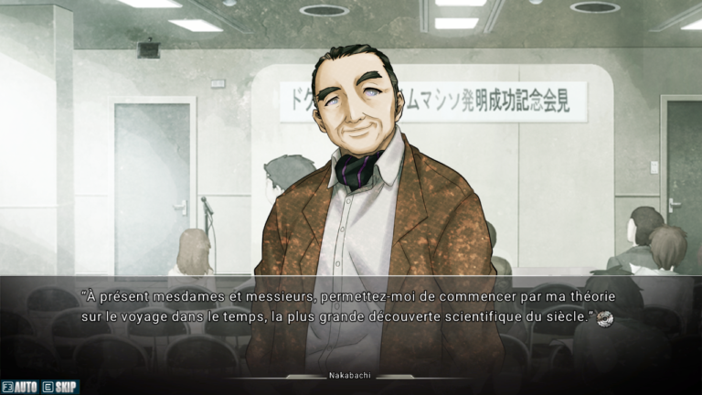

<a href="/">Revenir à l'index</a>

# Henshin Project - 10 Pager

## Gameplay

Le gameplay proposé est un mélange de _Visual Novel_ et de jeu de Puzzle.

### Visual Novel

La partie principale du jeu reprend les codes du _Visual Novel_ : Le jeu propose un développement narratif avec des personnages à l'écran qui interagissent ensemble. Le joueur peut faire avancer les dialogues à son rythme.

Ce format nous permet donc de faire jouer directement aux histoires trouvées dans les _Métamorphoses 

    <a href="/ten_pager/02.html">Précédent</a>
    <a href="/ten_pager/01.html">Table des matières</a>
    <a href="/ten_pager/04.html">Suivant</a>

    
Page 02 / 10

